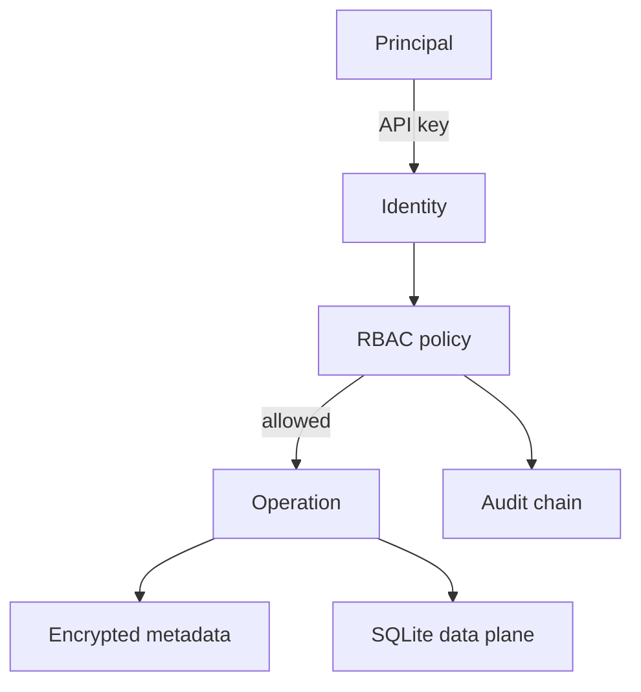

# Threat model — V4

## Activos

- datos de pago aceptados e identidad pseudonimizada;
- evidencia de ejecuciones, calidad, lineage y decisiones de acceso;
- claves HMAC, API y AES-GCM;
- políticas de confianza y gobierno con sus fingerprints;
- compatibilidad acumulada V1–V4.

## Controles acumulados

| Amenaza | Control |
| --- | --- |
| PII directa persistida | correo sustituido por HMAC-SHA256 |
| Conflicto por reintento | idempotencia conflict-aware y rollback |
| Deriva de esquema | compatibilidad explícita y fail-closed |
| Degradación de calidad | SLO persistido y estado `breached` |
| Clave compartida universal | principal individual y RBAC deny-by-default |
| Escalada horizontal | rol resuelto desde digest server-side, nunca desde el request |
| Ruta/error sensible en claro | AES-256-GCM con AAD y clave externa |
| Reutilización de nonce | 96 bits aleatorios nuevos por cifrado |
| Alteración del ledger | hash del evento + hash previo y triggers append-only |
| Borrado no autorizado | `admin`, permiso y fingerprint exacto |
| Borrado sin evidencia | eliminación y evento de auditoría en una transacción |
| Traversal | sólo basename `.csv` bajo raíz resuelta |
| Exposición HTTP | DTO por allowlist, CSP y `no-store` |
| Publicación accidental | loopback por defecto; red exige `--allow-network` |

## Fronteras

La política de gobierno contiene digests de claves, nunca claves. La clave de
cifrado sólo entra desde el entorno o un gestor de secretos. El navegador no
recibe digests, rutas internas, `subject_token` ni detalle cifrado bruto.

## Riesgos residuales

- la autenticación local por API key no ofrece MFA, SSO, expiración automática
  ni ciclo de vida corporativo; producción requiere un IdP o gateway;
- sólo se cifran campos sensibles seleccionados: SQLite, WAL y copias completas
  deben protegerse también mediante cifrado de volumen o SQLCipher;
- un administrador del host con acceso a proceso, base y claves puede alterar
  la aplicación o sustituir el archivo; no existe raíz de confianza externa;
- el encadenamiento detecta cambios si se conserva una cabeza confiable, pero
  no evita el reemplazo integral del archivo por una copia anterior;
- no hay rate limiting distribuido, TLS terminado por la aplicación ni lock
  entre múltiples procesos;
- `sessionStorage` limita persistencia, pero un XSS same-origin podría leer la
  clave activa; CSP y renderizado con `textContent` reducen la superficie;
- rotar AES-GCM requiere una migración explícita de ciphertexts.
