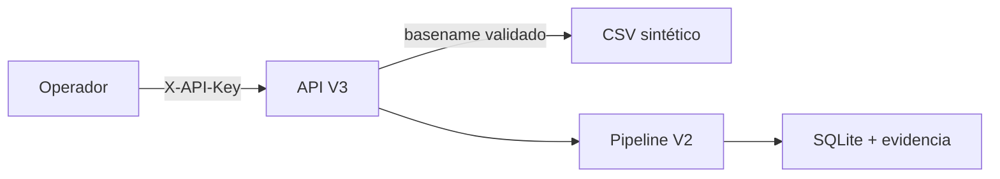

# Threat model — V3

## Activos

- datos de pago aceptados e identidad pseudonimizada;
- evidencia de ejecuciones, calidad y lineage;
- claves HMAC y API;
- política de confianza y sus fingerprints;
- superficie HTTP y sesión del dashboard;
- compatibilidad acumulada entre V1, V2 y V3.

## Controles acumulados

| Amenaza | Control |
| --- | --- |
| PII expuesta en tablas | correo sustituido por HMAC-SHA256 |
| Duplicación o conflicto | clave primaria e idempotencia fail-closed |
| Registro inválido descartado | cuarentena minimizada con motivo |
| Fuente o política intercambiada | SHA-256 de ambos artefactos por ejecución |
| Deriva silenciosa de esquema | compatibilidad explícita y rechazo cerrado |
| Calidad degradada sin señal | SLO, breaches persistidos y código de salida 2 |
| Lectura HTTP no autorizada | `X-API-Key` obligatorio y comparación constante |
| Traversal o lectura de archivo | sólo basename `.csv` bajo raíz resuelta |
| Exposición de host o token | DTO por allowlist sin ruta ni `subject_token` |
| XSS o inclusión remota | assets same-origin, CSP y render con `textContent` |
| Persistencia de clave en navegador | `sessionStorage`, nunca `localStorage` |
| Clickjacking o MIME confusion | `frame-ancestors`, `DENY` y `nosniff` |
| Publicación accidental en red | bind loopback; `--allow-network` obligatorio |
| Operaciones simultáneas locales | exclusión mutua de ingesta en el proceso |

## Fronteras

La API no transforma la clave de acceso en autorización por rol. La política y
el directorio de fuentes pertenecen al servidor. El navegador sólo recibe
datos minimizados.

## Riesgos residuales

- una API key compartida no aporta identidad individual, revocación selectiva
  ni autorización por rol; V4 incorpora RBAC;
- SQLite no cifra el archivo en reposo y un administrador del host puede
  modificar base o política;
- no hay rate limiting distribuido, TLS terminado por la aplicación ni
  protección frente a múltiples procesos;
- `sessionStorage` reduce persistencia, pero un XSS del mismo origen podría leer
  la clave; la CSP y la ausencia de HTML dinámico reducen esa superficie;
- el ledger aún no usa encadenamiento criptográfico;
- los request IDs facilitan correlación, pero V3 no persiste auditoría de actor.
